# 宠适官网（petsfit 中文站）

国内「宠适」品牌官网。Next.js 16（App Router）+ TypeScript，服务端渲染，面向 SEO 与 GEO。

## 运行

```bash
npm install
npm run dev      # 开发：http://localhost:3000，保存即热更新
npm run build    # 构建
npm run start    # 生产模式运行
npm run lint
npm run typecheck  # TypeScript 类型检查，构建时也会自动跑
```

## 结构

```
app/
  layout.tsx       根布局：字体、顶栏 + 抽屉菜单、页脚、入场动效
  page.tsx         首页：按栏目规划自上而下拼各区块
  series/[slug]/   系列详情页（照 ruffwear 商品页：左图右信息卡、场景图组、详情/规格页签、其他产品推荐轮播）
  products/        全部产品（分类切换，?cat=air-carrier|travel|home-living|houses）
  brand-story/     品牌故事（发展历程、创始人、价值观、荣誉资质）
  globals.css      全站样式（设计变量在 :root）
components/
  SiteChrome.tsx   顶栏（标语细条 + 吸顶菜单栏）+ 窄屏抽屉菜单   客户端组件
  SearchPanel.tsx  站内搜索面板（索引在 content/search.ts，从各内容文件自动汇总）
  Reveal.tsx       滚动入场动效的观察者              客户端组件
  Footer.tsx       页脚
  LogoMark.tsx     P 形品牌标
  home/            首页各区块；Hero、Reel、ProductTabs、Ticker、CampusCarousel 是客户端组件，其余是服务端组件
                   （TrustStrip=首屏下信任条，ProductTabs=三条产品线合一的分页区，自动轮换）
content/
  types.ts         全部内容数据的类型定义
  site.tsx         全站共用：导航、社媒、品牌片、公司信息
  story.ts         品牌故事页内容（摘自资料准备里的历程、荣誉、资质表与董事长专访）
  search.ts        站内搜索索引（从各内容文件自动汇总）
  home.ts          首页各区块的文案与图片
  series.ts        系列详情页数据
```

内容区块都是服务端组件，文字直接输出在 HTML 里；只有需要交互的部分才是客户端组件。

`components/home/` 下 About、Capability、Charity、Clients、Cta、Products 六个 B2B 区块首页暂未使用，留给 M3。

## 约定

- 色调、字体、整体版式以现有设计为准，调细节不改风格。设计变量集中在 `app/globals.css` 的 `:root`，
  其中 `--nav-h`（菜单栏高）、`--gut`、`--pad-y` 在 1100px / 760px 两个断点里各有一份。
- 字体经 `next/font` 在构建时下载并自托管，运行时不请求 Google Fonts。
- 视频不进仓库，放 CDN；页面只引用地址。
- URL 用英文。
- 上线前设环境变量 `SITE_URL=https://正式域名`（不设则为 `http://localhost:3200`）；sitemap、robots、canonical、分享卡片、结构化数据里的绝对地址都由它拼出，站点信息集中在 `content/seo.ts`。
- 文案和图片只改 `content/` 里的数据文件，字段以 `content/types.ts` 为准；少填或填错字段，`npm run typecheck` 会报出来。

## 页面截图

电脑端 1440 宽整页截图（2026-09-24），手机端 390 宽。图片在 `docs/screenshots/`，点击看大图。

### 首页

<a href="docs/screenshots/home-pc.jpg">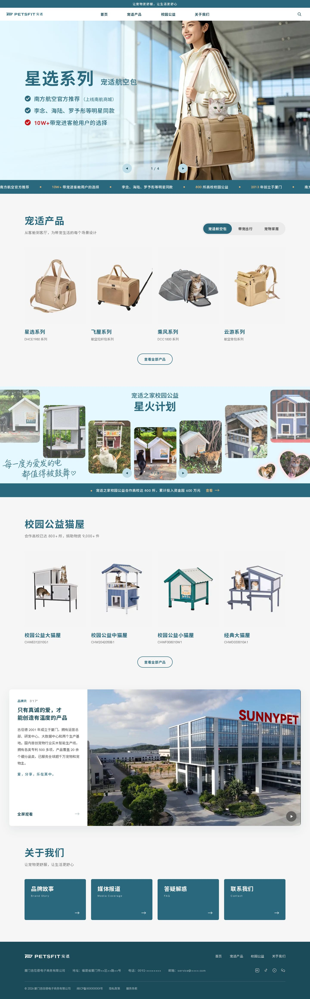</a> <a href="docs/screenshots/home-m.jpg">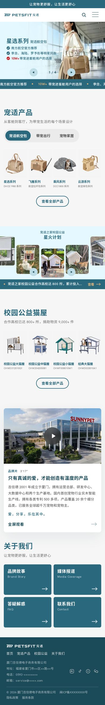</a>

### 全部产品 `/products`

<a href="docs/screenshots/products-pc.jpg">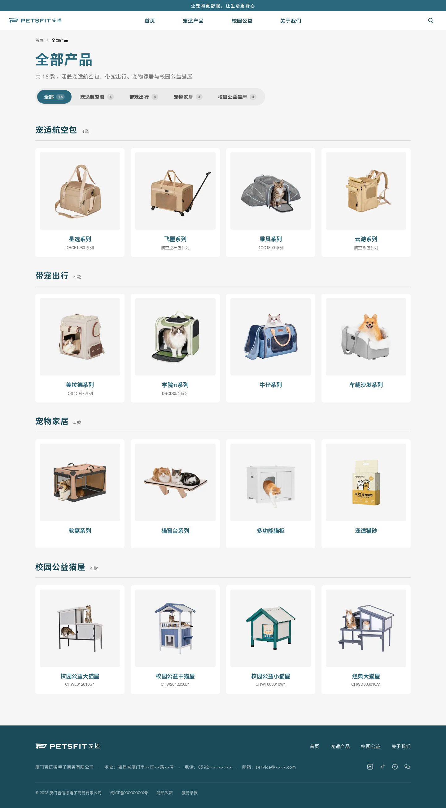</a> <a href="docs/screenshots/products-m.jpg">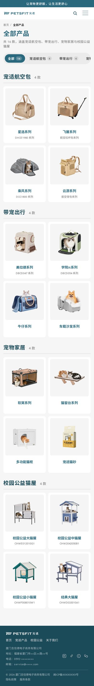</a>

### 品牌故事 `/brand-story`

<a href="docs/screenshots/brand-story-pc.jpg">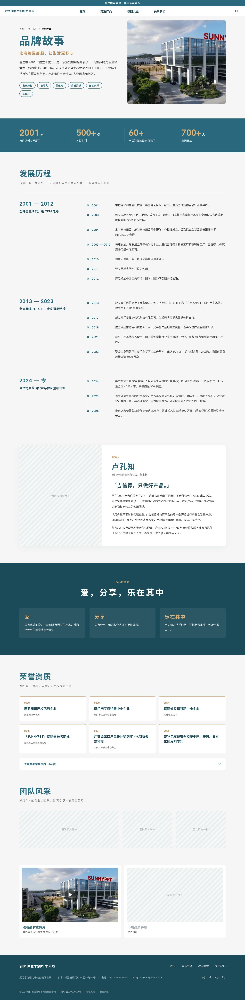</a> <a href="docs/screenshots/brand-story-m.jpg">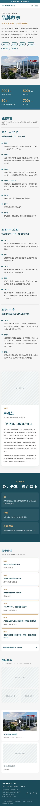</a>

### 系列详情页 `/series/<slug>`（12 个）

手机端示例（星选系列）：<a href="docs/screenshots/series-xingxuan-m.jpg">series-xingxuan-m.jpg</a>

<table>
<tr><td align="center"><a href="docs/screenshots/series-xingxuan-pc.jpg">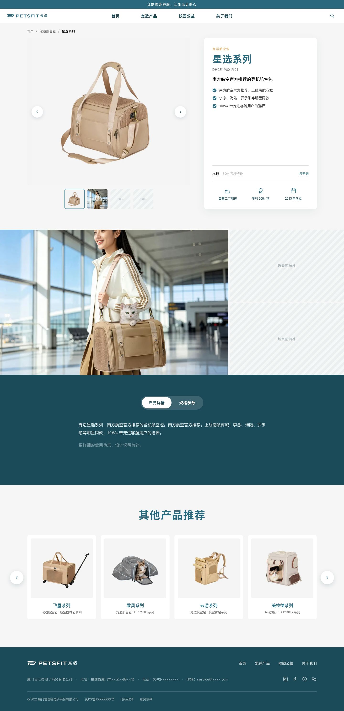</a><br><sub>星选系列 · <code>/series/xingxuan</code></sub></td><td align="center"><a href="docs/screenshots/series-feiwu-pc.jpg">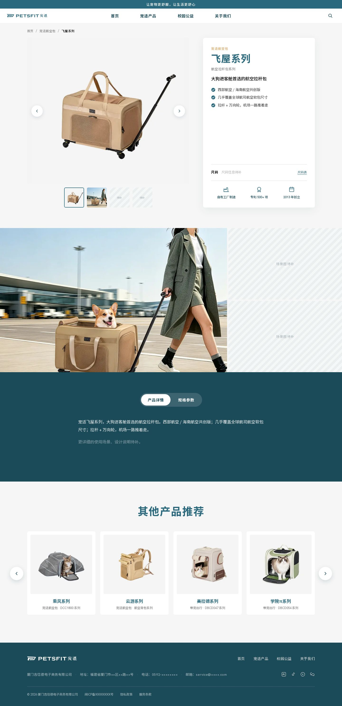</a><br><sub>飞屋系列 · <code>/series/feiwu</code></sub></td><td align="center"><a href="docs/screenshots/series-chengfeng-pc.jpg">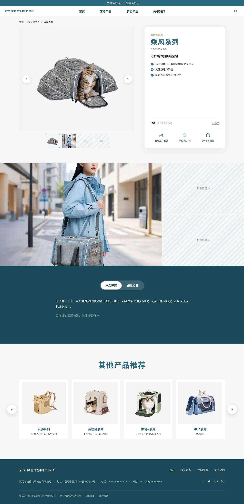</a><br><sub>乘风系列 · <code>/series/chengfeng</code></sub></td><td align="center"><a href="docs/screenshots/series-yunyou-pc.jpg">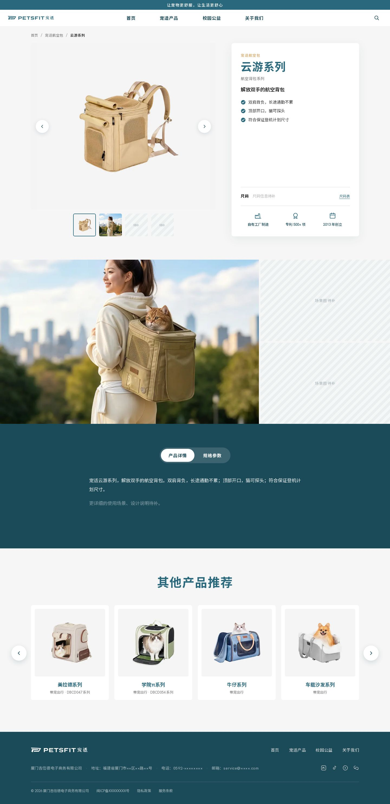</a><br><sub>云游系列 · <code>/series/yunyou</code></sub></td></tr>
<tr><td align="center"><a href="docs/screenshots/series-meilade-pc.jpg">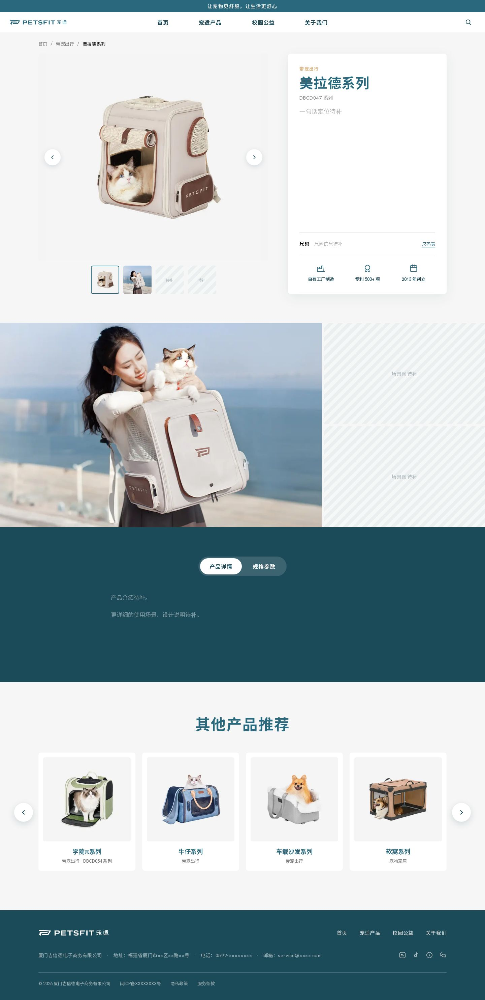</a><br><sub>美拉德系列 · <code>/series/meilade</code></sub></td><td align="center"><a href="docs/screenshots/series-xueyuanpi-pc.jpg">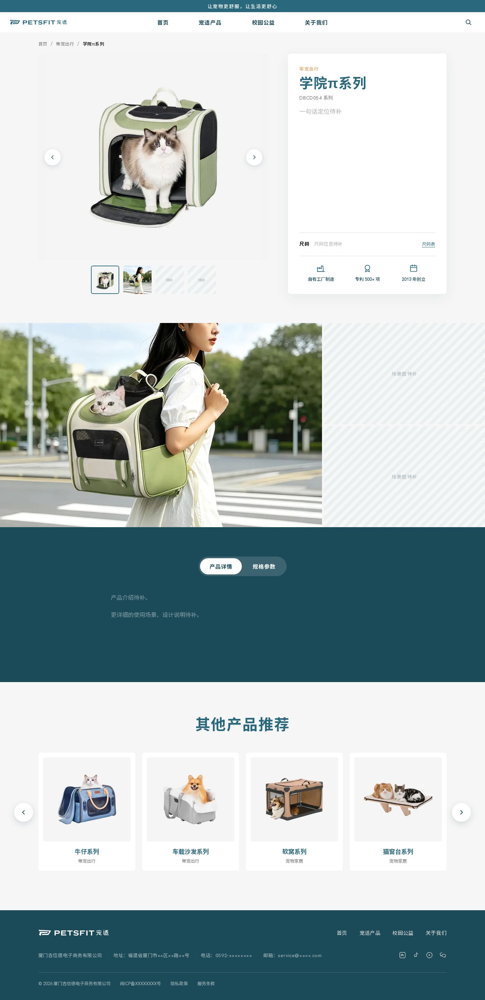</a><br><sub>学院π系列 · <code>/series/xueyuanpi</code></sub></td><td align="center"><a href="docs/screenshots/series-niuzai-pc.jpg">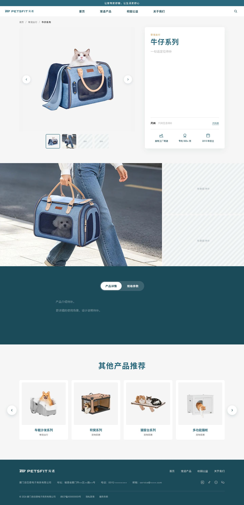</a><br><sub>牛仔系列 · <code>/series/niuzai</code></sub></td><td align="center"><a href="docs/screenshots/series-chezai-pc.jpg">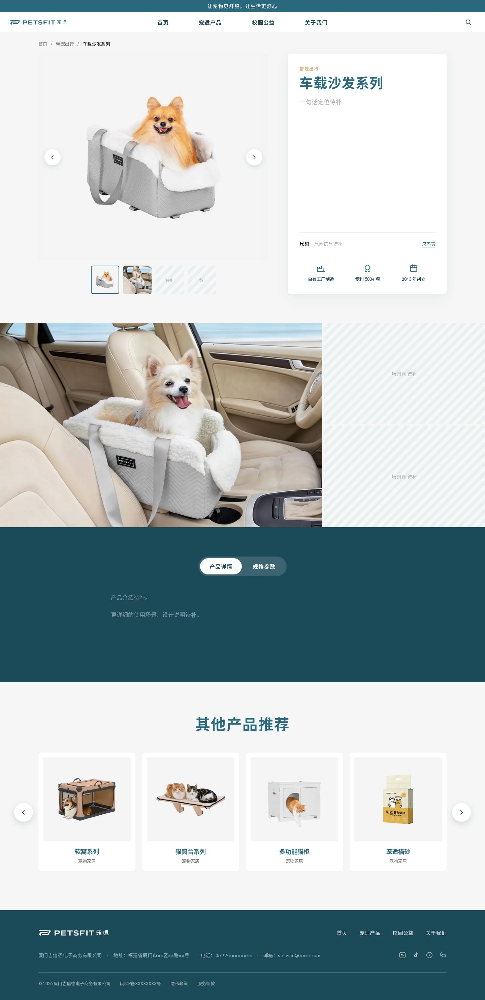</a><br><sub>车载沙发系列 · <code>/series/chezai</code></sub></td></tr>
<tr><td align="center"><a href="docs/screenshots/series-ruanwo-pc.jpg">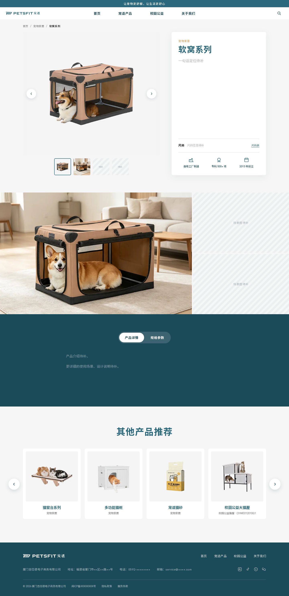</a><br><sub>软窝系列 · <code>/series/ruanwo</code></sub></td><td align="center"><a href="docs/screenshots/series-maochuangtai-pc.jpg">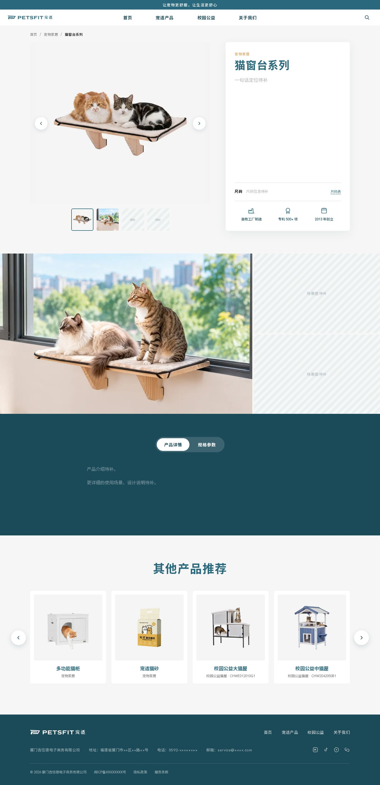</a><br><sub>猫窗台系列 · <code>/series/maochuangtai</code></sub></td><td align="center"><a href="docs/screenshots/series-maogui-pc.jpg">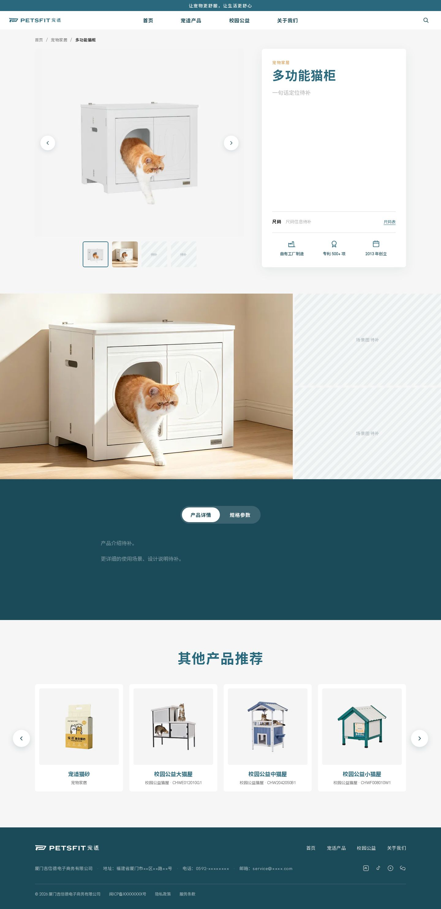</a><br><sub>多功能猫柜 · <code>/series/maogui</code></sub></td><td align="center"><a href="docs/screenshots/series-maosha-pc.jpg">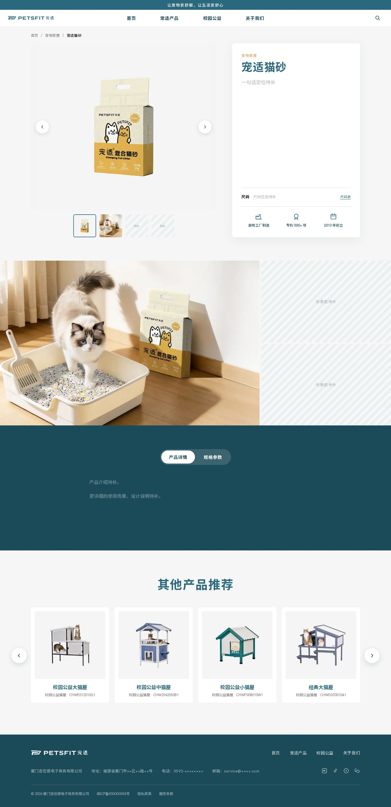</a><br><sub>宠适猫砂 · <code>/series/maosha</code></sub></td></tr>
</table>

## 进度

- [x] M1 由单文件原型 1:1 迁移到 Next 工程
- [x] M2 首页按栏目规划改造，接入海报与真实文案
- [x] M2.1 系列详情页首版、抽屉菜单改版
- [x] M2.2 品牌片接入首页
- [x] 迁移 TypeScript；手机紧凑版（手机保留电脑版构图，整体缩小）
- [x] 09-24 改版：去掉白卡、大图铺满书脊以外的整屏，强调色换成品牌蓝绿 + 驼色，首屏下加信任条，三条产品线合成分页区（自动轮换）。随后取消左侧书脊改为顶栏（标语细条 + 吸顶菜单栏），首屏放大到第一屏底边正好是信任条。改版前的版本打了标签 `classic-2026-09-24`，对比或退回用 `git checkout classic-2026-09-24`
- [ ] M3 关于我们各子页（历程 / 荣誉 / 资质 / 社媒 / 创始人）
- [x] M4 基础：每页 metadata（描述、canonical、Open Graph）、Organization / WebSite / 面包屑 JSON-LD、sitemap、robots
- [ ] M4 其余：Product / FAQPage / VideoObject 结构化数据（等产品资料、FAQ、宣传片上传日期）
- [ ] M5 系列页与产品详情页（待产品数据）
